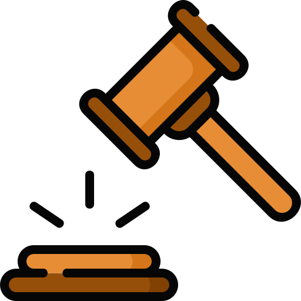

# Resumen de la Ley de Protección de Datos Personales y Ley de Ciberseguridad

## Ley Marco de Ciberseguridad

- **Objetivo**: Proteger la infraestructura crítica y los sistemas informáticos del país frente a ciberataques e incidentes de seguridad.
- **Ámbito de Aplicación**: Organismos públicos y privados que operan en sectores esenciales y de importancia vital.
- **Principios**:
  - **Prevención**: Implementar medidas para anticiparse a incidentes de ciberseguridad.
  - **Coordinación**: Colaborar entre entidades para una respuesta efectiva ante incidentes.
  - **Responsabilidad**: Las organizaciones deben asumir la responsabilidad de proteger sus sistemas.
- **Derechos y Deberes**: Establece deberes específicos para las organizaciones y derechos para los ciudadanos en caso de incidentes.
- **Sanciones**: Define multas y otras medidas en caso de incumplimiento de las obligaciones de ciberseguridad.

## Ley Protección de Datos Personales
- **Objetivo**: Proteger la privacidad y los datos personales de las personas, asegurando un tratamiento adecuado de la información.
- **Ámbito de Aplicación**: Se aplica a organismos públicos y privados que manejan datos personales en Chile.
- **Principios**:
  - **Consentimiento**: Se requiere el permiso del titular para procesar sus datos.
  - **Finalidad**: Los datos deben ser utilizados solo para el propósito para el que fueron recopilados.
  - **Exactitud**: La información debe ser precisa y actualizada.
  - **Seguridad**: Deben implementarse medidas para proteger los datos de accesos no autorizados.
- **Derechos del Titular**: Acceder, rectificar, cancelar y oponerse al tratamiento de sus datos.
- **Sanciones**: Se establecen multas y responsabilidades para quienes infrinjan la ley.

